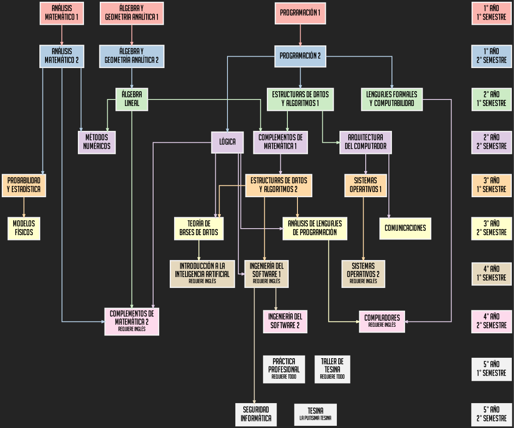

# Árbol de Correlativas de LCC

Código para generar un árbol de correlativas para la carrera de Licenciatura en Ciencias de la Computación de la FCEIA.

## Compilación

Hay que tener Graphviz para compilarlo, después hay que instalar las dos fuentes que están en el repo y por último correr (por lo menos en linux)

```sh
dot -Tpng correlativas.dot > correlativas.png
```

---


